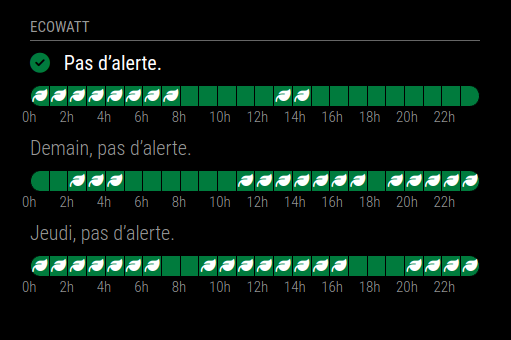
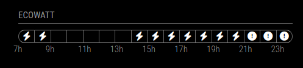

# Module: MMM-Ecowatt
This module displays the current level of signal of ecowatt set by RTE for metropolitan france, including description and graph.

Message, Graph and Color Legend display may be enabled or disabled independently. The number of days to display can be fixed.

<p align="left">



</p>

[MagicMirror Project on Github](https://github.com/MichMich/MagicMirror) | [Ecowatt](https://www.monecowatt.fr/)

⚠️ **MMM-Ecowatt 2.1** (December 2023) uses the **new EcoWatt API** (v5). Don’t forget to [subscribe to EcoWatt v5](https://data.rte-france.com/catalog/-/api/consumption/Ecowatt/v5.0) on RTE API portal and **attach it** to **your application** to continue using **your current token**!

## Installation:

In your terminal, go to your MagicMirror's Module folder:
```shell
cd ~/MagicMirror/modules
```

Clone this repository:
```shell
git clone https://github.com/tttooommm56/MMM-Ecowatt
```

Go to your MMM-Ecowatt's Module folder:
```shell
cd ~/MagicMirror/modules/MMM-Ecowatt
```

Install dependencies:
```shell
npm install
```

Configure the module in your config.js file.

## Update:

In your terminal, go to your MMM-Ecowatt's Module folder:
```shell
cd ~/MagicMirror/modules/MMM-Ecowatt
```

Incorporate changes from this repository:
```shell
git pull
```

Install dependencies:
```shell
npm install
```

## Configuration:

### Basic configuration

To use this module, add it to the modules array in the `config/config.js` file:
```javascript
modules: [
	{
		module: "MMM-Ecowatt",
		position: "top_left",
		config: {
			apiTokenBase64: "your_api_token_base64",
		}
	}
]
```

### Options

The following properties can be configured:


| Option                       | Description
| ---------------------------- | -----------
| `apiTokenBase64`             | The [Ecowatt](https://data.rte-france.com/catalog/-/api/consumption/Ecowatt/v5.0) API Token (base-64 encoded), which can be obtained by [subscribing](https://data.rte-france.com/catalog/-/api/consumption/Ecowatt/v5.0) on RTE API portal and by clicking on the `Copier en base 64` button in [your applications](https://data.rte-france.com/group/guest/apps). It's free! <br><br> This value is **REQUIRED**
| `days`                       | Number of days to display. <br><br> **Possible values:** `1` - `4` <br> **Default value:** `1` (1 day)
| `updateInterval`             | How often does the content needs to be fetched? (Milliseconds)  <br><br> **Possible values:** `90000` - `86400000` <br> **Default value:** `20 * 60 * 1000` (20 minutes)
| `animationSpeed`             | Speed of the update animation. (Milliseconds) <br><br> **Possible values:**`0` - `5000` <br> **Default value:** `1000` (1 second)
| `showText`                   | Show the ecowatt message for the next days (for `days` > 1). <br><br> **Possible values:** `true` or `false` <br> **Default value:** `true`
| `showGraph`                  | Show the ecowatt detail graph for each day. <br><br> **Possible values:** `true` or `false` <br> **Default value:** `true`
| `showCarbonFreeProduction`   | Display ecowatt indication for carbon-free production (leaf icon in the chart). <br><br> **Possible values:** `true` or `false` <br> **Default value:** `true`
| `useColorLegend`             | Use the colored icons. <br><br> **Possible values:** `true` or `false` <br> **Default value:** `true`
| `initialLoadDelay`           | The initial delay before loading. If you have multiple modules that use the same API key, you might want to delay one of the requests. (Milliseconds) <br><br> **Possible values:** `1000` - `5000` <br> **Default value:**  `0`
| `apiBaseUrl`                 | The RTE API base URL. <br><br> **Default value:**  `'https://digital.iservices.rte-france.com'`
| `apiOAuthPath`               | The OAuth API endPoint. <br><br> **Default value:**  `'/token/oauth/'`
| `apiSignalsPath`             | The Signals API endPoint. <br><br> **Default value:**  `'/open_api/ecowatt/v4/signals'`

## License:

This module is licensed under the MIT License
